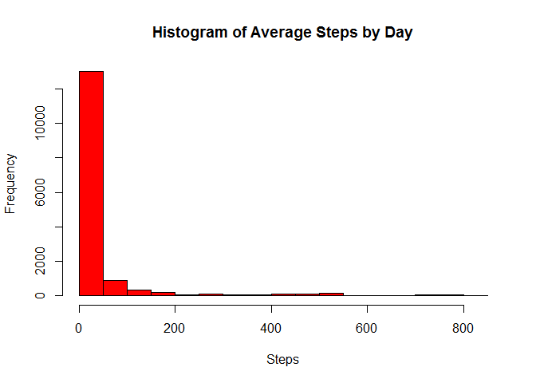
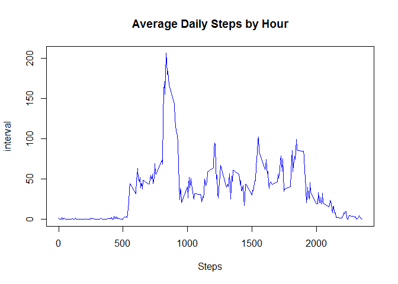
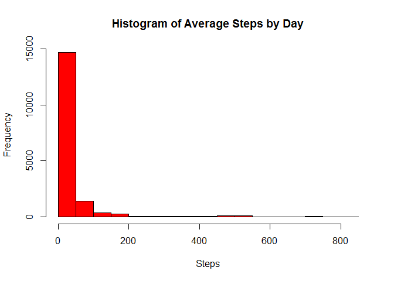
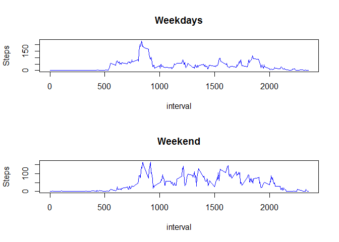

# Reproducible Research: Peer Assessment 1


## Loading and preprocessing the data


```r
download.file("http://d396qusza40orc.cloudfront.net/repdata%2Fdata%2Factivity.zip", "activity.zip")
unzip("activity.zip")
data=read.csv("activity.csv")
data$date=as.Date(data$date, format="%Y-%m-%d")
library(plyr)
data <- mutate(data, hour = interval %/% 100, minute = interval %% 100)  
DateTime=strftime(paste(data$date," ", data$hour,":",data$minute, sep=""), format="%Y-%m-%d %k:%M")
DateTime=as.POSIXct(DateTime,format="%Y-%m-%d %k:%M")
data=mutate(data, DateTime = DateTime)
head(data)
```

```
##   steps       date interval hour minute            DateTime
## 1    NA 2012-10-01        0    0      0 2012-10-01 00:00:00
## 2    NA 2012-10-01        5    0      5 2012-10-01 00:05:00
## 3    NA 2012-10-01       10    0     10 2012-10-01 00:10:00
## 4    NA 2012-10-01       15    0     15 2012-10-01 00:15:00
## 5    NA 2012-10-01       20    0     20 2012-10-01 00:20:00
## 6    NA 2012-10-01       25    0     25 2012-10-01 00:25:00
```

## What is mean total number of steps taken per day?

1. Make a histogram of the total number of steps taken each day


```r
StepsByDay=aggregate(data$steps,by=list(DateTime),mean,na.action = na.omit)
hist(StepsByDay[,2], col="red", main="Histogram of Average Steps by Day", xlab="Steps")
```

 

2. Calculate and report the mean and median total number of steps taken per day


```r
mean(na.omit(StepsByDay[,2]))
```

```
## [1] 37.3826
```

```r
median(na.omit(StepsByDay[,2]))
```

```
## [1] 0
```

## What is the average daily activity pattern?

1. Make a time series plot (i.e. type = "l") of the 5-minute interval (x-axis) and the average number of steps taken, averaged across all days (y-axis)


```r
x=NULL
for (i in unique(data$interval)){
x=rbind(x, data$steps[data$interval== i])
}
fn <- function(x) mean(x, na.rm=T)
intervalMean <- apply(x,1,fn)
plot(unique(data$interval), intervalMean, type="l", lwd=1.5, col="blue",
     main="Average Daily Steps by Hour", xlab="Steps", ylab="interval")
```

 

2. Which 5-minute interval, on average across all the days in the dataset, contains the maximum number of steps?


```r
unique(data$interval)[which.max(apply(x,1,fn))]
```

```
## [1] 835
```

## Imputing missing values

1. Calculate and report the total number of missing values in the dataset (i.e. the total number of rows with NAs)


```r
sum(!complete.cases(data))
```

```
## [1] 2304
```

2. Devise a strategy for filling in all of the missing values in the dataset. The strategy does not need to be sophisticated. For example, you could use the mean/median for that day, or the mean for that 5-minute interval, etc.


```r
iMean=NULL
for (i in 1:length(unique(data$date))){
iMean=rbind(iMean, as.matrix(intervalMean))
}
for (i in 1:nrow(data)){
    if (is.na(data$steps[i])) data$steps[i] <- iMean[i]
}
```

3. Create a new dataset that is equal to the original dataset but with the missing data filled in.


```r
head(data)
```

```
##       steps       date interval hour minute            DateTime
## 1 1.7169811 2012-10-01        0    0      0 2012-10-01 00:00:00
## 2 0.3396226 2012-10-01        5    0      5 2012-10-01 00:05:00
## 3 0.1320755 2012-10-01       10    0     10 2012-10-01 00:10:00
## 4 0.1509434 2012-10-01       15    0     15 2012-10-01 00:15:00
## 5 0.0754717 2012-10-01       20    0     20 2012-10-01 00:20:00
## 6 2.0943396 2012-10-01       25    0     25 2012-10-01 00:25:00
```

```r
sum(!complete.cases(data))
```

```
## [1] 0
```

4. Make a histogram of the total number of steps taken each day and calculate and report the mean and median total number of steps taken per day. Do these values differ from the estimates from the first part of the assignment? What is the impact of imputing missing data on the estimates of the total daily number of steps?


```r
StepsByDay=aggregate(data$steps,by=list(DateTime),mean,na.action = na.omit)
hist(StepsByDay[,2], col="red", main="Histogram of Average Steps by Day", xlab="Steps")
```

 

```r
mean(na.omit(StepsByDay[,2]))
```

```
## [1] 37.3826
```

```r
median(na.omit(StepsByDay[,2]))
```

```
## [1] 0
```

There is not any apparent change in the plots (except for an increase in the fequencies). The mean and median remain unchanged.

## Are there differences in activity patterns between weekdays and weekends?

1. Create a new factor variable in the dataset with two levels – “weekday” and “weekend” indicating whether a given date is a weekday or weekend day.


```r
weekdays=weekdays(data$date)
weekdays[weekdays=="lunes"] <- "weekdays"
weekdays[weekdays=="martes"] <- "weekdays"
weekdays[weekdays=="miércoles"] <- "weekdays"
weekdays[weekdays=="jueves"] <- "weekdays"
weekdays[weekdays=="viernes"] <- "weekdays"
weekdays[weekdays=="sábado"] <- "weekend"
weekdays[weekdays=="domingo"] <- "weekend"
weekdays=as.factor(weekdays)
data=cbind(data,weekdays)
```

2. Make a panel plot containing a time series plot (i.e. type = "l") of the 5-minute interval (x-axis) and the average number of steps taken, averaged across all weekday days or weekend days (y-axis).


```r
weekdaysData=data[weekdays=="weekdays",]
weekendData=data[weekdays=="weekend",]
fn <- function(x) mean(x, na.rm=T)
wd=NULL
for (i in unique(weekdaysData$interval)){
    wd=rbind(wd, weekdaysData$steps[weekdaysData$interval== i])
}
intervalMeanWd <- apply(wd,1,fn)
we=NULL
for (i in unique(weekendData$interval)){
    we=rbind(we, weekendData$steps[weekendData$interval== i])
}
intervalMeanWe <- apply(we,1,fn)
par(mfrow=c(2,1))
plot(unique(weekdaysData$interval), intervalMeanWd, ylab="Steps", xlab="interval", type="l", col="blue", main="Weekdays")
plot(unique(weekendData$interval), intervalMeanWe, ylab="Steps", xlab="interval", type="l", col="blue", main="Weekend")
```

 

The person goes running early in weekdays, but he runs more at weekends since 10am.
